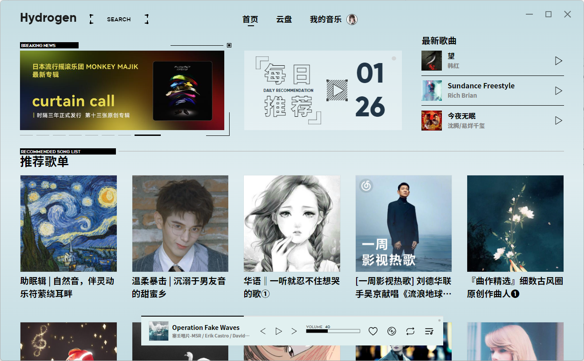
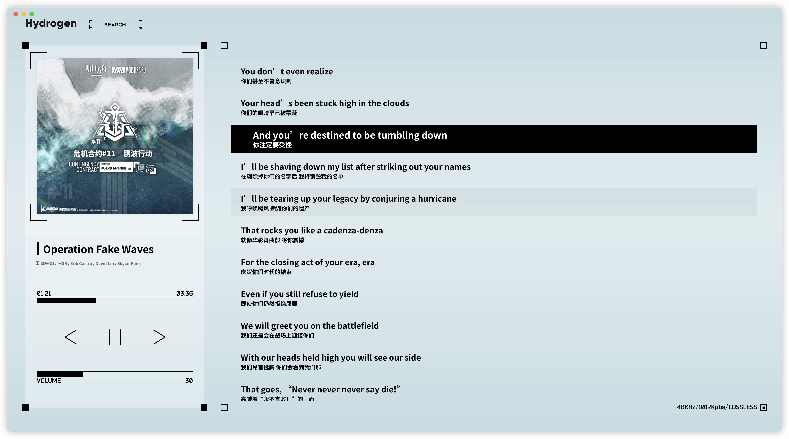
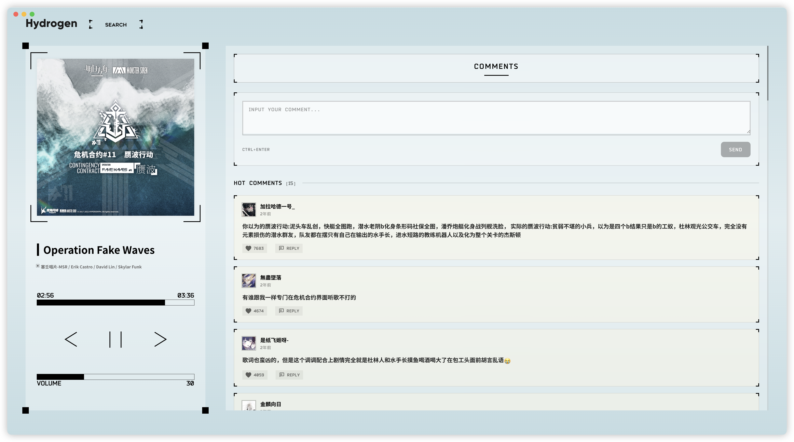
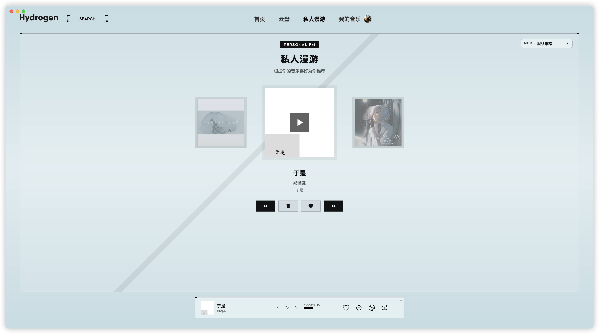
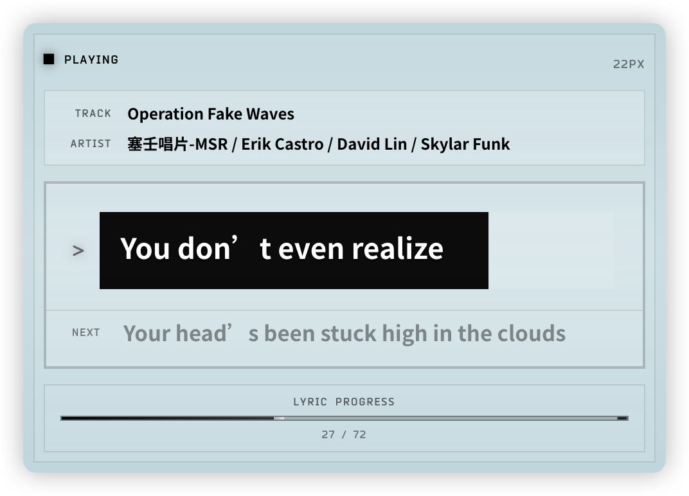
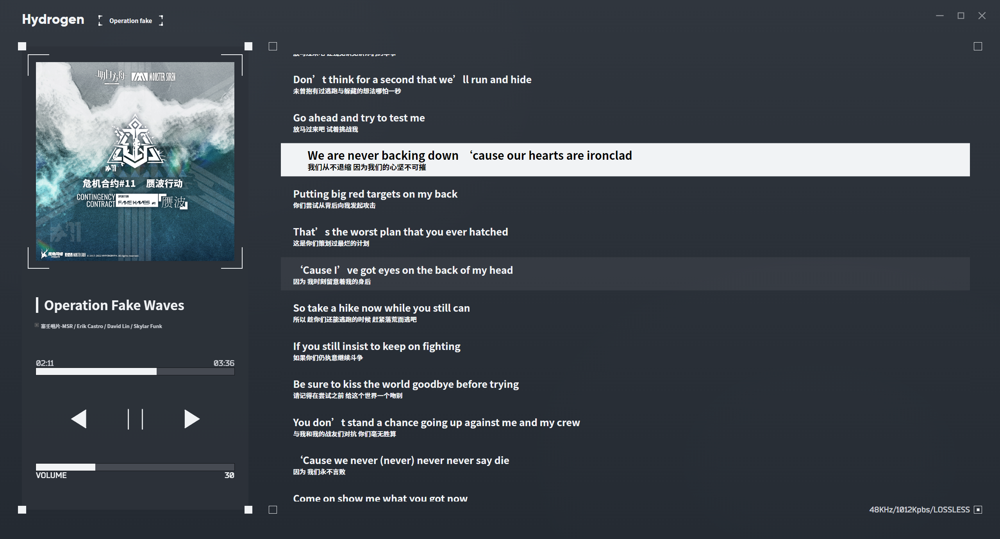

<p align="center">
  
</p>

<h1 align="center">Hydrogen Music 复活版</h1>

<p align="center">
  <strong>一个基于 Electron 与 Vue 3 的明日方舟风网易云播放器</strong>
  <br />
  Hydrogen Music 复活版，延续原项目的视觉风格，并补齐登录、播放、下载、歌词、评论、云盘、私人漫游、本地音乐与桌面端集成能力。
</p>

<p align="center">
  <a href="https://github.com/ldx123000/Hydrogen-Music/releases">
    
  </a>
  <a href="LICENSE">
    
  </a>
  
  
</p>

<p align="center">
  <a href="#项目定位">项目定位</a>
  ·
  <a href="#功能总览">功能总览</a>
  ·
  <a href="#截图预览">截图预览</a>
  ·
  <a href="#安装使用">安装使用</a>
  ·
  <a href="#开发与构建">开发与构建</a>
  ·
  <a href="#声明与致谢">声明与致谢</a>
</p>

<p align="center">
  
</p>

## 项目定位

Hydrogen Music 是一个非官方桌面音乐播放器项目。当前仓库基于原 Hydrogen Music 的设计方向继续维护，重点目标是让应用重新具备可用、稳定、完整的桌面端体验。

本复活版围绕以下方向持续迭代：

- 恢复并增强账号登录、曲库访问、播放解析、下载、云盘等基础能力。
- 加入私人漫游、评论区、桌面歌词、音乐视频、本地音乐、塞壬唱片等扩展体验。
- 优化桌面端集成，包括托盘、全局快捷键、Dock 菜单、Linux MPRIS、媒体信息、自动更新与多平台安装包。
- 保持简洁克制的界面风格，同时补充深色模式、自定义字体、音频可视化、背景封面模糊等可选设置。

## 功能总览

### 账号与基础服务

- 支持网易云音乐二维码、邮箱、手机号登录。
- 内置增强版网易云 API 服务，应用启动后自动拉起本地服务。
- 支持账号状态隔离、登录信息清理、VIP 信息展示与会话迁移。
- 支持同步最近播放，让播放行为更接近官方客户端体验。

### 播放体验

- 支持标准、较高、极高、无损、Hi-Res、高清环绕声、沉浸环绕声、杜比全景声、超清母带等音质偏好。
- 支持播放列表、专辑、歌手热门歌曲、每日推荐、搜索结果、私人漫游、本地音乐、电台节目与塞壬唱片音源。
- 支持顺序、循环、单曲循环、随机播放、播放队列持久化与断点恢复。
- 可选歌曲无缝衔接，通过预缓冲下一首音频降低切歌空隙。
- 可选音频可视化、背景封面模糊、歌词模糊。

### 曲库与搜索

- 支持歌单、专辑、歌手、MV、每日推荐等常用曲库入口。
- 支持歌曲、专辑、歌手、歌单、MV 的综合搜索。
- 歌单、专辑、歌手、本地音乐等列表支持搜索过滤。
- 支持收藏歌单管理、喜欢歌曲、添加到歌单、下一首播放、显示专辑等常用操作。

### 私人漫游

- 新增完整私人漫游页面，支持默认推荐、熟悉偏好、探索发现、场景推荐与 AI DJ 模式。
- 场景推荐支持运动、专注、夜晚情绪等子模式。
- 内置近期去重队列，减少短时间内反复推荐同一首歌。
- 支持上一首、下一首、喜欢、不喜欢、封面轮播与候选歌曲预取。

### 歌词与评论

- 播放器右侧支持歌词与评论区切换。
- 歌词支持原文、翻译、罗马音、间奏提示、字体大小与显示偏好设置。
- 桌面歌词支持独立窗口、置顶显示、拖动、锁定、缩放、当前句与下一句展示。
- 评论区支持精彩评论、最新评论、楼层回复、点赞、回复、发送与复制评论。

### 下载、本地音乐与云盘

- 支持歌曲下载、下载队列、暂停/恢复/取消与窗口进度展示。
- 下载时可写入基础标签、封面、歌词标签，并可选择额外生成独立 LRC 文件。
- 可选择下载目录，也可为每首下载歌曲创建独立文件夹。
- 支持扫描多个本地音乐目录，并按文件夹、歌手、专辑维度浏览。
- 支持云盘列表、容量信息、上传、删除、播放与常见音频/视频文件识别。

### 视频、电台与扩展音源

- 支持网易云 MV 播放。
- 支持音乐视频功能，可绑定 B 站账号/BV 号、选择分 P 与清晰度、设置音频与视频时间段同步、缓存视频文件。
- 支持收藏电台与电台节目播放，播放器会展示电台节目简介。
- 支持 Monster Siren 塞壬唱片官方音源专区。

### 桌面端能力

- 支持浅色、深色、跟随系统主题。
- 支持自定义字体与系统字体选择。
- 支持全局快捷键、系统托盘、退出行为设置。
- macOS 支持原生窗口交通灯、Dock 菜单与歌曲信息展示。
- Linux 支持 MPRIS 媒体控制。
- Windows / macOS / Linux 均提供打包配置。

## 截图预览

<table>
  <tr>
    <td></td>
    <td></td>
  </tr>
  <tr>
    <td></td>
    <td></td>
  </tr>
  <tr>
    <td></td>
    <td></td>
  </tr>
  <tr>
    <td colspan="2"></td>
  </tr>
</table>

## 安装使用

前往 [Releases](https://github.com/ldx123000/Hydrogen-Music/releases) 下载对应平台的安装包。

当前构建配置支持：

- Windows：NSIS 安装包、Portable、Zip。
- macOS：DMG。
- Linux：AppImage、Deb、RPM。

首次使用建议先完成网易云账号登录。部分功能依赖账号权限、VIP 权益或第三方服务登录状态。

## 开发与构建

### 环境要求

- Node.js `20.19.0+` 或 `22.12.0+`
- npm

项目使用 Vite 7、Vue 3、Electron 38 与 electron-builder。开发时需要同时启动 Vite 服务与 Electron 客户端。

### 本地开发

```shell
npm ci
```

终端一启动前端开发服务：

```shell
npm run dev
```

终端二启动 Electron：

```shell
npm start
```

开发环境下主窗口会加载 `http://localhost:5173/`，桌面歌词窗口会加载 `http://localhost:5173/desktop-lyric.html`。应用内置网易云 API 服务默认使用本地端口 `36530`。

### 构建前端资源

```shell
npm run build
```

### 打包当前平台客户端

```shell
npm run dist
```

打包产物会输出到 `release/<version>/`。

如需指定平台，可将参数透传给构建脚本：

```shell
npm run dist -- --win
npm run dist -- --mac
npm run dist -- --linux
```

## 技术栈

- 桌面框架：Electron
- 前端框架：Vue 3、Vue Router、Pinia
- 构建工具：Vite、electron-builder
- 音频播放：Howler、Web Audio API
- 视频播放：Plyr
- 本地元数据：music-metadata、node-id3、metaflac-js、ffmpeg-static
- 桌面集成：electron-store、electron-updater、electron-win-state、mpris-service

## 项目结构

```text
Hydrogen-Music
├─ background.js                 # Electron 主进程入口
├─ electron-builder.config.cjs   # 多平台打包配置
├─ src
│  ├─ api                        # 网易云、MV、电台、云盘、塞壬等接口封装
│  ├─ components                 # 播放器、歌词、评论、私人漫游等组件
│  ├─ electron                   # IPC、下载、本地音乐、托盘、MPRIS 等主进程模块
│  ├─ store                      # Pinia 状态管理
│  ├─ utils                      # 播放、下载、歌词、视频、主题、账号等工具
│  └─ views                      # 页面级视图
├─ img                           # README 截图资源
└─ scripts                       # 构建辅助脚本
```

## 声明与致谢

本项目仅供个人学习与研究使用，禁止用于商业用途或任何非法用途。项目内涉及的音乐、歌词、评论、图片、视频等内容版权归其权利方所有。

本仓库基于原 [Hydrogen-Music](https://github.com/Kaidesuyo/Hydrogen-Music) 的创意与方向继续维护，感谢原作者的设计与实现。如原作者或相关权利方认为本仓库存在不妥，请联系维护者处理。

代码基于 [MIT License](LICENSE) 开源。
